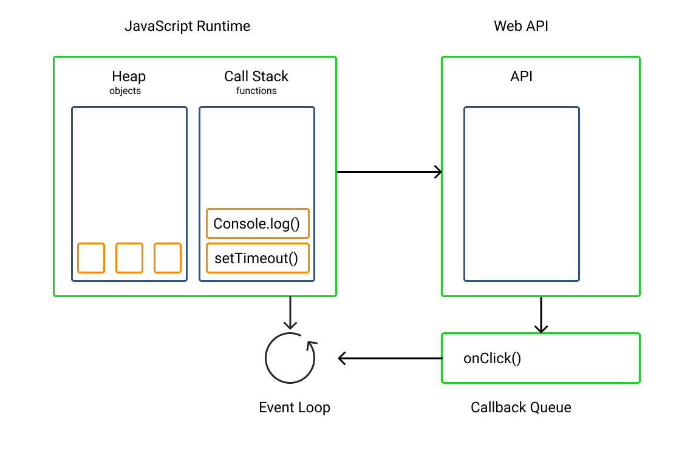

JavaScript, **single-thread** bir dildir. Bu da, aynı anda sadece bir görevi yerine getirebilir anlamına gelir. Bu threadler event-based'tir ve yalnızca event'ların gerçekleşmesiyle triggerlanırlar.

Genellikle, bir programın diğer bölümleri bozmadan normal akışının dışında çalışması, daha iyi bir uygulama performansı sağlamak için gereklidir. Ancak, JavaScript dili, aynı anda birden fazla ifadenin yürütülmesine izin verecek şekilde tasarlanmamıştır. İfadeler birbirini takip ederek çalışır. Peki JavaScript birbirini bloklamayan görevleri, diğer ifadeleri etkilemeden nasıl gerçekleştiriyor?

## Call Stack, Heap ve Queue

JavaScript single-thread bir dil olmasına rağmen, tarayıcı karmaşık işlemler gerçekleştirmek için yeterince güçlüdür. Call stackler, heapler ve queuelar, tarayıcının bu işlemleri gerçekleştirmesine izin veren birer parçasıdır.

**Heap:** Kodumuzda tanımlanan nesnelerin ve değişkenlerin depolandığı yer veya bellek. Tarayıcı içindeki değişkenlere ve nesnelere bellek burada tahsis edilir.

**Callback queue**: Kodların yürütülmeden önce sıraya konulduğu ve depolandığı yerdir. Queue, first-in, first-out (FIFO) prensibine göre çalışır.

**Call Stack:** Call stack, function call'ları tutar. Programın yürütülmesi sırasında her fonksiyon stackin en üstüne eklenir ve tamamlandıktan sonra çıkarılır. Programın yürütülmesi sırasında çağrılan fonksiyonları kaydeden basit bir veri yapısıdır.

Her fonksiyon, expressionları ve statementları içeren bir stack frame oluşturur ve ardından stacke eklenir. Bir değer return edildiğinde, stackten çıkarılır.

Birbiri içerisinde nested şekilde bulunan tüm fonksiyonlar için stack frame oluşturulur. Stack içerisindeki öğeler genellikle, first-in, last-out (FILO) şeklinde sıralanır.

## Concurrency nedir?

Concurrency, aynı anda birden fazla hesaplamanın gerçekleşmesine izin verir. Aynı anda birden fazla görevin gerçekleştirilme fikrini açıklamak için kullanılır. **Parallelism** ile karıştırılmamalıdır.

Concurrency, farklı hedeflere sahip farklı görevleri aynı anda gerçekleştirme kavramını ifade ederken, parallelism, programın çeşitli bölümlerinin aynı anda bir görevi gerçekleştirmesini içerir.

- **Parallelism**, programların daha hızlı çalışmasını sağlamak için kullanılan bir computation türüdür. Bu programlama yaklaşımında, işlemler paralel olarak yürütülür. Programlar küçük tasklere bölünür ve aynı hedefe ulaşmak için aynı anda gerçekleştirilirler.
- **Multi-threading**, aynı kaynağı paylaşırken bağımsız olarak iki veya daha fazla talimatın yürütüldüğü bir programlama tekniğidir. JavaScript, tasarım gereği multi-thread bir dil değildir, ancak modern web workerların kullanımı ile mutl-threading elde edilebilir.

## Concurrency nasıl çalışır?

JavaScript'in concurrency modeli, kodu eşzamanlı olarak yürüten event loop'una dayanır. JavaScript, varsayılan olarak, event looplar, call backler, promiseler veya async/await kullanarak asenkron bir programlama modeliyle concurrency oluşturur. Rust ve Go gibi bazı diller, concurrent tasklerin yürütülmesi sırasında basitlik ve performans sunarlar. Ancak, JavaScript concurrency için tasarlanmamıştır, buna rağmen JavaScript event-loop ile server ve client sided olarak concurrent çalışabilir.

## Event Loop

Event loop, fonksiyonları asenkron olarak yürütmek için JavaScript tarafından benimsenen modeldir. Queue'ya alınan görevleri yürütmekten sorumludur ve JavaScript'in multi-thread görevleri gerçekleştirebilme yeteneğinin arkasındaki sırdır.

JavaScript, bir betik yürütmesini en üstten başlatır ve son satıra kadar devam eder. Genellikle yürütülecek işlevler callback queue'da saklanır.

Event loop sürekli olarak hem callback queue'yu hem de call stack'i izler. Call stack'in boş olup olmadığını kontrol eder ve callback queue'daki bir sonraki öğeyi call stack'e pushlar. Call stack boş değilse event loop hiçbir şey yapmaz. Call stack boş olana kadar bekler ve callback queue'daki bir sonraki işlevi call stack'e pushlar.

Aşağıdaki resim JavaScript runtime'ını, Web API'yi, call stack'i ve event loop'u göstermektedir:



Event loop sürekli olarak callback queue'dan fonksiyonları alır ve call stack boşaldığında bunları call stack'e iter. Call stack'teki görev tamamlandıktan sonra, event loop callback queue'daki bir sonraki öğeyi alır ve işlemeye başlamak için call stack'e gönderir. Bu, olay döngüsünün nasıl çalıştığının temel prensibidir.

## Callback

Node.js, hızlı I/O işlemlerini gerçekleştirmek için callback'leri yoğun bir şekilde kullanır. Callbackler, başka bir fonksiyonun argümanı olarak geçen işlevlerdir. JavaScript'te callbackler, uygulamaların beklenmedik donmasını azaltmak için kullanılır.

Bir callback fonksiyonu, kendisini bir argüman olarak alan dıştaki fonksiyonun tamamlanmasından sonra yürütülür. Başka bir fonksiyonun tamamlanmasının hemen ardından bir fonksiyonu çalıştırmak için kullanılır. setTimeout() yöntemi, başka bir işlevi argüman olarak alan bir işlevin bir örneğidir. İşte bir örnek:

```javascript
const greeting = function () {
  console.log("Hello there");
};
setTimeout(greeting, 3000);
```

Callback fonksiyonu (greeting), setTimeout() metoduna bir argüman olarak iletilir ve setTimeout() işlemini tamamladıktan sonra 3 saniye bekler ve hemen sonra yürütülür.

Callback fonksiyonları, JavaScript'in kodları asenkron olarak yürütmesine izin verir. setTimeout() fonksiyonu yürütülürken, diğer ifadeler eş zamanlı olarak yürütülebilir. Bu yöntemi kullanarak, JavaScript concurrent çalışabilir ve birden fazla ifadeyi aynı anda yürütebilir.

## Promise'ler

Promise'ler, JavaScript'te asenkron görevleri ele almak için kullanılabilecekleri anlamında callback'lere benzerler. Promise'lerin benimsenmesinden önce, görevleri asenkron olarak ele almak için callback fonksiyonları kullanılırdı. Ancak, çoklu nested callback fonksiyonlarını ele almak bir sorun haline geldi ve bu da programa gereksiz karmaşıklık ekledi. Promise'ler, nested callback'leri ele almanın ideal yolu haline geldi.

Bir promise, bir asenkron işlemden sonra bir değer üreten bir nesnedir. Asenkron işlemin başarılı olup olmadığını belirlemek için iyi bir yoldur. Bir promise kullanımına dair örnek aşağıda verilmiştir:

```javascript
  let promise = new Promise(function (resolve, reject) {
    resolve("done")
    reject("error")
}

  promise.then(function(value) {
    console.log(value)
})
```

Bir promise, resolved ve rejected promise'leri bitirmek için _.then_ ve _.catch_ yöntemlerini kullanır.

Promisler asenkron olarak çalıştığından, yukarıdaki kodda olduğu gibi işlevlerin işlemi promise'ın sonucuna bağlı olan fonksiyonlar _.then_ yöntemi içine yerleştirilmelidir. Bu şekildeki kodlar yalnızca promise alındığında çalışır.

## Async/await

Promisleri kullanmak ve zincirlemek karmaşık ve anlaşılması zor olabilir, bu sorunu çözmek için async/await ortaya çıktı. Asenkron kodları verimli bir şekilde çalıştırmak ve tanımlamak için async/await kullanılır.

**async** anahtar kelimesi, bir işlevin asenkron olduğunu tanımlamak için bir işlevin önüne yerleştirilir ve işlevin her zaman bir promise döndürdüğünden emin olur.

**await** anahtar kelimesi, bir promise dönene kadar işlevi geciktirir. Bir fonksiyon, bir promise alınana kadar yürütmesini tamamlamaz. await anahtar kelimesi, bir async işlevi dışında kullanılamaz.

Örnek bir async/await kodu:

```javascript
async function() {
    await setTimeout(() => {
      console.log("Welcome Back!")
    }, 2000)
}

  console.log("Hello")
```

Asenkron fonksiyonların işlenmesi zaman alabilir ve diğer görevlerin yürütülmesini engellemeden arka planda eşzamanlı olarak çalışabilir.

JavaScript'teki asenkron işlevler async anahtar kelimesi ile tanımlanır. Bu, JavaScript'e işlevin yürütmesini bitirmesinin zaman alacağını ve yürütülürken diğer görevlere devam edebileceğini söyler.

Bu, JavaScript'in, asenkron işlevden bir yanıt almadan önce async işlevinin dışındaki diğer işlemleri çalıştırmasına olanak tanır. await anahtar kelimesi, işlevin yürütmesini tamamlaması zaman alan kısmını tanımlar. Yukarıdaki kodun sonucu şudur:

```javascript
Hello
Welcome Back!
```

Görebileceğiniz gibi, "Hello" mesajı "Welcome Back!" mesajından önce görüntüleniyor. Bu, asenkron fonksiyonun arka planda çalıştığı ve "Welcome Back"i görüntülemek için yaklaşık iki saniye beklediği çin olur. JavaScript async fonksiyonu arkaplanda çalıştırırken, async fonksiyondan bir sonuç beklemeden diğer ifadeleri çalıştırmaya devam eder.

Bu, JavaScript'in görevleri gerçekleştirip, ifadeleri concurrent olarak çalıştırabilmesinin bir örneğidir.

Callback'ler, promise'ler ve async/await, görevleri event loop ve tarayıcının Web API'leri yardımıyla concurrent olarak çalıştırılmasını sağlayan JavaScript özellikleridir.

## Sonuç

Veri işleme sırasında sequential kod yürütülmesi nedeniyle birçok sorunla karşılaşılır. Verilerin işlenmesinin ne kadar süreceğini bilmek zordur. Sequentail bir kod, diğer tüm kodları engeller ve uygulamanın daha fazla yürütülmesini engeller.

Concurrent kod, sequential kodun engelleme sorununu ortadan kaldırır ve birden çok kullanıcı isteğini veya olayını herhangi bir sorun olmadan aynı anda işleyebilir.

JavaScript, varsayılan olarak single-threaded bir programlama dilidir ve kodunu sequential olarak çalıştırır. Ancak, JavaScript, CPU ağırlıklı uygulamalar oluştururken en iyi seçenek değildir çünkü JavaScript hala single-threaded bir dildir ve tek bir işlemci çekirdeğinde tek bir işlem çalıştırabilir.

CPU ağırlıklı uygulamalar geliştirilirken CPU intensive görevleri ele alabilen diğer diller tercih edilmelidir.
